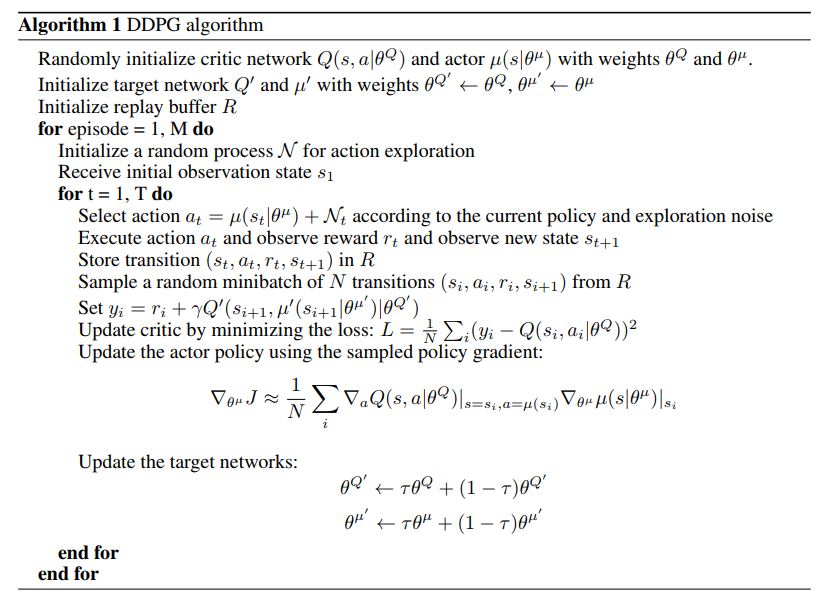
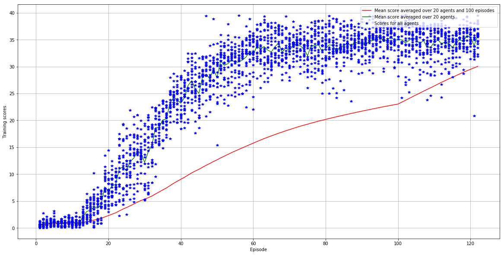

[//]: # (Image References)

[image1]: https://user-images.githubusercontent.com/10624937/43851024-320ba930-9aff-11e8-8493-ee547c6af349.gif "Trained Agent"
[image2]: https://user-images.githubusercontent.com/10624937/43851646-d899bf20-9b00-11e8-858c-29b5c2c94ccc.png "Crawler"


# Project 2: Continuous Control

### Introduction

For this project, we work with the [Reacher](https://github.com/Unity-Technologies/ml-agents/blob/master/docs/Learning-Environment-Examples.md#reacher) environment.

![Trained Agent][image1]

In this environment, a double-jointed arm can move to target locations. A reward of +0.1 is provided for each step that the agent's hand is in the goal location. Thus, the goal of your agent is to maintain its position at the target location for as many time steps as possible.

The observation space consists of 33 variables corresponding to position, rotation, velocity, and angular velocities of the arm. Each action is a vector with four numbers, corresponding to torque applicable to two joints. Every entry in the action vector should be a number between -1 and 1.

### Distributed Training

For this project, two separate versions of the Unity environment were provided by Udacity:
- The first version contains a single agent.
- The second version contains 20 identical agents, each with its own copy of the environment.  

## Implementation
For this project, the second version with 20 idential agents was chosen to be solved. 

###  The Deep Deterministic Policy Gradient (DDPG)

This project implements the DDPG (Deep Deterministic Policy Gradient) method for continuous action-space, as described in the  paper [Continuous control with deep reinforcement learning](https://arxiv.org/abs/1509.02971). The algorithm is shown below (copied from the paper):

 

This method is an "Actor-Critic" method, which includes two deep neural networks,one is called the Actor and the other the Critic, where the Actor is used to approximate the optimal policy deterministically, and the Critic is used to evaluate the optimal action value by using the actor's best believed action.     
could be classified as a DQN method for continuous action space.  The Actor is used as an approximate maximizer to calculate the new target value for training the action value function much in the way [DQN (the Deep Q-Networks)](https://storage.googleapis.com/deepmind-media/dqn/DQNNaturePaper.pdf) does. 

InDQN, we have two copies of the network weights, the regular and the target network.In the DDPG, we have two copies of the network weights for each of the Actor and Critic networks, a regular and target network for the Actor and a regular and target network for the Critic.

Two interesting aspects of the DDPG are:
  - Experience repay with the replay buffer: This is the same as DQN.
  
  - Soft Updates: This is different from the original DQN, in which the target network is updated much less frequently than the regular network (copied from the regular network every 10,000 time steps) ; In DDPG, for each time step, we mix 0.01% of regular network weights with the target network weights. The soft update strategy leads to faster convergence in practice and could be applied to any method that uses a target network, includes the DQN.  
 

During training, at each time step, noise is added that sampled from [The Ornstein-Uhlenbeck process](https://en.wikipedia.org/wiki/Ornstein%E2%80%93Uhlenbeck_process) was added to the action outputted from the actor networks.  

### The Python Code 

The code implemented for this project is based on the [DDPG code for the pendulum example](https://github.com/udacity/deep-reinforcement-learning/tree/master/ddpg-pendulum) in the Deep Reinforcement Learning Nanodegree. The following are the files:

- model.py: In this Python file, the deep Neural Network models are defined. 
- ddpg_agent.py:  In this Python file, the ddpg agent class, the Ornstein-Uhlenbeck noise proces and the Replay Buffer memory are defined.
- Continuous_Control.ipynb:  It is the main routine Jupyter notebook file that trains the DDPG agent.

### The DDPG Parameters 

I experimented with different combinations of the DDPG parameters, especially the buffer size, the batch size, and the learning rate of the Actor and Critic networks, and the paramters for the Ornstein-Uhlenbeck process. I found that the sigma value of the Ornstein-Uhlenbeck process is very important for the results. Also, the random seed could affect the training too.

The DDPG agent has the following parameter values:

```
BUFFER_SIZE = int(1e6)  # replay buffer size
BATCH_SIZE = 128        # minibatch size
GAMMA = 0.99            # discount factor
TAU = 1e-3              # for soft update of target parameters
LR_ACTOR = 1e-4         # learning rate of the actor 
LR_CRITIC = 1e-4        # learning rate of the critic
WEIGHT_DECAY = 0        # L2 weight decay
```

The Actor Neural Networks have three fully connected layers:

```
The size of input nodes is 33, which is the size of the state
A fully Connected Layer (400 nodes, Relu activation)
A Fully Connected Layer (300 nodes, Relu activation) 
A fully connectted layer (4 output nodes, which is the size of the actions, Tanh aciviation for continous action)
```

The Critic Neural Networks have three fully connected layers:

```
The size of input nodes is 33, which is the size of the state
A fully Connected Layer (400 nodes, Relu activation)
A Fully Connected Layer (333 nodes, that is 300 + the size of the action, which is 33, Relu activation) 
A fully connectted layer (1 output node for action value)
```

The Ornstein-Uhlenbeck process has the following parameters:
```
mu = 0 
theta = 0.15
sigma=0.1
```
###  The Results
The mean score averaged over 100 continuous episodes and over all the 20 agents from the training process is shown below, which shows that the DDPG reached the target score of 30 in 122 episodes.
 
[The mean score averaged over 100 consecutive episodes and over all agents](images/training.txt)

In the following figure, the scores for every agent, every episode was shown as blue *, the the mean score over all 20 agents was shown in green line, and the mean score averaged over 100 consecutive episodes, and over all agents was shown in red line. 



The Actor and Critic networks after reaching the target score were saved in the file `checkpoint_actor.pth` and `checkpoint_critic.pth`

### Possible Improvements

There are multiple ways that could potentially improve the performance of the DDPG architecture:
 -  Further tune the parameters
 -  Use prioritized experience play
 -  Update the local networks every N steps instead of every step
  
  
The following policy based architectures could also potentially increase the performance, which I would like to explore next:

- [PPO](https://arxiv.org/pdf/1707.06347.pdf), Proximal Policy Optimization, a stochastic policy gradient method.
- [A3C](https://arxiv.org/pdf/1602.01783.pdf), an asynchronous gradient descent variant of the actor-critic method.
- [D4PG](https://openreview.net/pdf?id=SyZipzbCb), the distributed distributional deep deterministic policy gradient method. 
